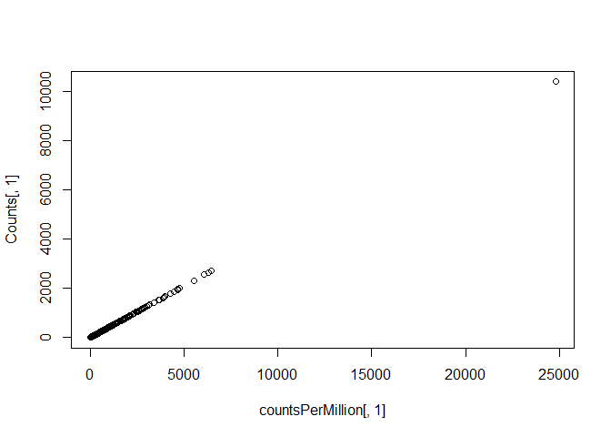
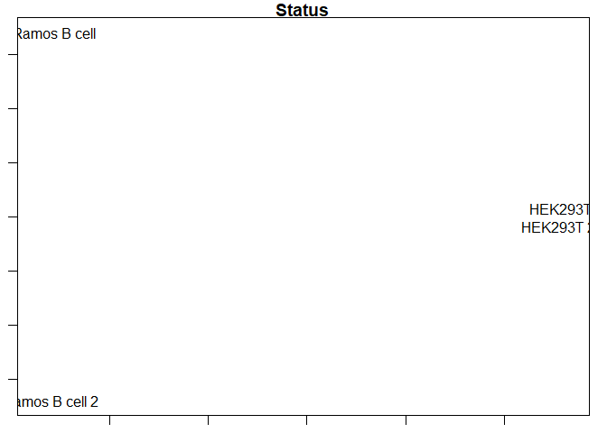
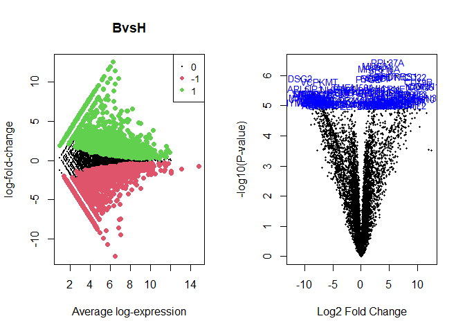
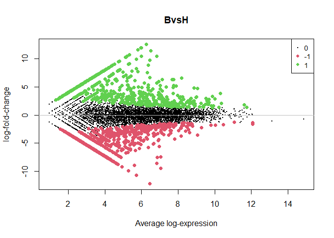

Repositori de GitHub: https://github.com/jordirodriguezm/Segona-PEC.git

#Abstract
Aquest treball neix de la necessitat de conèixer més sobre el transcriptoma humà. En aquest treball s'han trobat "high-throughput squence" del transcriptoma humà provenents de cèl·lules B de ronyó. Això s'ha fet mitjançant "shotgun sequencing" de transcrits per generar lectures aleatòriament distribuïdes. D'aquests un 50% eren de localitzacions genòmiques úniques, de les quals un 80% eren exons ja coneguts.

#Objectius

L'objectiu princial del treball és conèixer més el transcriptoma huma, per aconseguir això realitzarem un anàlisi de "gene diferentiation" entre les dues cèl·lules usades en l'estudi.

#Anàlisi (materials i métodes)
##Preparació
###Carrega de dades
Primer procedirem a carregar les dades, en aquest anàlisi utilitzarem el dataset4.

```r
setwd('C:/Users/User/Desktop/PEC2/PEC2datasets')
new_table<-read.table("dataset4_count_table.txt", header = TRUE, sep = "\t" )
head(new_table)
```

```
##              gene SRX008333 SRX008334 SRX008331 SRX008332
## 1 ENSG00000000003         0         0        35        36
## 2 ENSG00000000005         0         0         0         0
## 3 ENSG00000000419        16        20         9        15
## 4 ENSG00000000457        10        13        28        27
## 5 ENSG00000000460        10         9         9        11
## 6 ENSG00000000938         1         2         0         0
```

###Paquets i llibreries
Un cop les dades estan carregades prepararem els paquets i les llibreries que seran utilitzades per a l'estudi.


```r
'if(!require(magrittr)) install.packages("magrittr", dep=TRUE, repos = "http://cran.us.r-project.org")
if(!require(org.Mm.eg.db)) install.packages("org.Mm.eg.db", dep=TRUE, repos = "http://cran.us.r-project.org")
if(!require(dplyr)) install.packages("dplyr", dep=TRUE, repos = "http://cran.us.r-project.org")
if(!require(ggplot2)) install.packages("ggplot2", dep=TRUE,repos = "http://cran.us.r-project.org")
if(!require(pheatmap)) install.packages("pheatmap", dep=TRUE, repos = "http://cran.us.r-project.org")
if(!require(RColorBrewer)) install.packages("RColorBrewer", dep=TRUE, repos = "http://cran.us.r-project.org")
if(!require(ggbeeswarm)) install.packages("ggbeeswarm", dep=TRUE, repos = "http://cran.us.r-project.org")
if(!require(gplots)) install.packages("gplots", dep=TRUE, repos = "http://cran.us.r-project.org")

if(!require(BiocManager)) install.packages("BiocManager", repos = "http://cran.us.r-project.org")

if(!require(airway)) BiocManager::install("airway")
if(!require(Rsamtools)) BiocManager::install("Rsamtools")
if(!require(GenomicFeatures)) BiocManager::install("GenomicFeatures")
if(!require(DESeq2)) BiocManager::install("DESeq2")
if(!require(apeglm)) BiocManager::install("apeglm")
if(!require(BiocParallel)) BiocManager::install("BiocParallel")
if(!require(genefilter)) BiocManager::install("genefilter")
if(!require(AnnotationDbi)) BiocManager::install("AnnotationDbi")
if(!require(ReportingTools)) BiocManager::install("ReportingTools")
if(!require(RUVSeq)) BiocManager::install("RUVSeq")
if(!require(sva)) BiocManager::install("sva")
if(!require(Gviz)) BiocManager::install("Gviz")
if(!require(org.Mm.eg.db)) BiocManager::install("org.Mm.eg.db") 
if(!require(edgeR)) BiocManager::install("edgeR") 
if(!require(Biobase)) BiocManager::install("Biobase") 
if(!require(GO.db)) BiocManager::install("GO.db")'

library("ggplot2")
library("BiocManager")
library("Biobase")
library("limma")
library("edgeR")
library("RColorBrewer")
library("pheatmap")
library("gplots")
library("org.Hs.eg.db")
library("Glimma")
library("GO.db")
```

##Tractament inicial de dades
###Preparació de dades
Ara començem ja amb el tractament de dades, a partir de la taula new_table on està el count.data del dataset_4, primer mirem que s'hagi carregat de la forma que volem. Després definim els noms de les files i variem el noms de les columnes per facilitar el tractament.

```r
#Observem la taula per veure que sigui tot correcte
dim(new_table)
```

```
## [1] 52580     5
```

```r
head(new_table)
```

```
##              gene SRX008333 SRX008334 SRX008331 SRX008332
## 1 ENSG00000000003         0         0        35        36
## 2 ENSG00000000005         0         0         0         0
## 3 ENSG00000000419        16        20         9        15
## 4 ENSG00000000457        10        13        28        27
## 5 ENSG00000000460        10         9         9        11
## 6 ENSG00000000938         1         2         0         0
```

```r
#Fem que la columna "gens" sigui el nom de les files, posteriorment canviem el nom de les columnes a el tipus de cèl·lula què és cadascuna per fer-ho més còmode al visualitzar.
Counts <- new_table[,-1]
rownames(Counts) <- new_table[,1]
colnames(Counts) <- c("Ramos B cell","Ramos B cell 2","HEK293T","HEK293T 2")
head(Counts)
```

```
##                 Ramos B cell Ramos B cell 2 HEK293T HEK293T 2
## ENSG00000000003            0              0      35        36
## ENSG00000000005            0              0       0         0
## ENSG00000000419           16             20       9        15
## ENSG00000000457           10             13      28        27
## ENSG00000000460           10              9       9        11
## ENSG00000000938            1              2       0         0
```

###Creacio DGEList
A continuació ens interesa crear l'objecte DGEList, aquest ens permetrà contenir els nostres "read counts" i totes les dades associades.

```r
dgList<-DGEList(counts=Counts, genes=rownames(Counts))

#L'objecte DGList permet observar les dades, els counts i els gens com veiem a continuació.
dgList$samples
```

```
##                group lib.size norm.factors
## Ramos B cell       1   418650            1
## Ramos B cell 2     1   386825            1
## HEK293T            1   505719            1
## HEK293T 2          1   482368            1
```

```r
head(dgList$counts)
```

```
##                 Ramos B cell Ramos B cell 2 HEK293T HEK293T 2
## ENSG00000000003            0              0      35        36
## ENSG00000000005            0              0       0         0
## ENSG00000000419           16             20       9        15
## ENSG00000000457           10             13      28        27
## ENSG00000000460           10              9       9        11
## ENSG00000000938            1              2       0         0
```

```r
head(dgList$genes)
```

```
##                           genes
## ENSG00000000003 ENSG00000000003
## ENSG00000000005 ENSG00000000005
## ENSG00000000419 ENSG00000000419
## ENSG00000000457 ENSG00000000457
## ENSG00000000460 ENSG00000000460
## ENSG00000000938 ENSG00000000938
```

###Filtrat
Hi ha molts gens en aquest dataset però la majoria d'ells o no està expressat o no té suficients reads per contribuir a l'anàlisi. Mantindrem només els gens representats al menys 1cpm en dues mostres.

```r
countsPerMillion <- cpm(dgList)
summary(countsPerMillion)
```

```
##   Ramos B cell      Ramos B cell 2        HEK293T           HEK293T 2       
##  Min.   :    0.00   Min.   :    0.00   Min.   :    0.00   Min.   :    0.00  
##  1st Qu.:    0.00   1st Qu.:    0.00   1st Qu.:    0.00   1st Qu.:    0.00  
##  Median :    0.00   Median :    0.00   Median :    0.00   Median :    0.00  
##  Mean   :   19.02   Mean   :   19.02   Mean   :   19.02   Mean   :   19.02  
##  3rd Qu.:    0.00   3rd Qu.:    0.00   3rd Qu.:    0.00   3rd Qu.:    0.00  
##  Max.   :24791.59   Max.   :20844.05   Max.   :38968.28   Max.   :38570.14
```

```r
countCheck <- countsPerMillion > 1
head(countCheck)
```

```
##                 Ramos B cell Ramos B cell 2 HEK293T HEK293T 2
## ENSG00000000003        FALSE          FALSE    TRUE      TRUE
## ENSG00000000005        FALSE          FALSE   FALSE     FALSE
## ENSG00000000419         TRUE           TRUE    TRUE      TRUE
## ENSG00000000457         TRUE           TRUE    TRUE      TRUE
## ENSG00000000460         TRUE           TRUE    TRUE      TRUE
## ENSG00000000938         TRUE           TRUE   FALSE     FALSE
```

```r
keep <- which(rowSums(countCheck) >= 2)
dgList <- dgList[keep,]

#El nou summary podem veure que les dades semblen més normals i què a simple vista s'han hagut de esborrar molts gens no expressats ja que no n'hi ha tants.
summary(cpm(dgList)) 
```

```
##   Ramos B cell       Ramos B cell 2         HEK293T           HEK293T 2       
##  Min.   :    0.000   Min.   :    0.000   Min.   :    0.00   Min.   :    0.00  
##  1st Qu.:    2.389   1st Qu.:    2.585   1st Qu.:    5.93   1st Qu.:    6.22  
##  Median :   21.498   Median :   23.266   Median :   33.62   Median :   33.17  
##  Mean   :  128.635   Mean   :  128.722   Mean   :  128.66   Mean   :  128.66  
##  3rd Qu.:  109.877   3rd Qu.:  111.161   3rd Qu.:  120.62   3rd Qu.:  120.24  
##  Max.   :24791.592   Max.   :20844.051   Max.   :38968.28   Max.   :38570.14
```

```r
#Aquest pendent i que les dades siguin properes a aquest demostren que ha funcionat bé.
plot(countsPerMillion[,1],Counts[,1])
```

<!-- -->

###Normalització
És important normalitzar les dades dels RNA-seq, mitjançant el paquet edgeR realitzarem el mètode "trimmed mean of M-values"

```r
dgList <- calcNormFactors(dgList, method="TMM")

par(mar=c(1,1,1,1))
plotMDS(dgList) 
title("Status")
```

<!-- -->

En aquest gràfic teòricament s'haurien de veure les dades agrupades per les dues especies que tenim presents, com podem veure les dades de HEK estan agrupades mentres que les dades de Ramos B cell només comparteixen un eix, mentre en l'altre no. Això podria indicar algun problema en les dades.

##Preparació del model
Ara procedim a preparar el model que utilitzarem més endavant, creem una matriu de disseny partint de dos vectors el nom de les mostres i les rèpliques que té cadascuna. 

```r
sampleType<-c("Bcell","Bcell","Hek","Hek")
sampleReplicate <- paste("S", rep(1:2, each=2), sep="")

designMat <- model.matrix(~0 + sampleType)
designMat
```

```
##   sampleTypeBcell sampleTypeHek
## 1               1             0
## 2               1             0
## 3               0             1
## 4               0             1
## attr(,"assign")
## [1] 1 1
## attr(,"contrasts")
## attr(,"contrasts")$sampleType
## [1] "contr.treatment"
```

##Quality control
Ara realitzem diferents gràfics per veure la qualitat de les dades que hem obtingut.

```r
#Renombrem la taula creada a "y" per ser més senzilla d'utilitzar.
y <- dgList
```

###Mida de llibreries i distribució
Començarem amb un barplot per veure si hi ha diferències importants entre els tamanys de les llibreries.

```r
y$samples$lib.size
```

```
## [1] 418650 386825 505719 482368
```

```r
barplot(y$samples$lib.size,names=colnames(y),las=2)
title("Barplot de la mida de llibreries")
```

-1.png)<!-- -->

Observant el gràfic de barres es veuen diferències significatives en la mida.

Seguidament ja que les dades de counting data no es distribueixen segons una distribució normal, cal examinar les distribucions dels recomptes. Farem servir la funció cpm tant per obtenir recomptes de log2 per milió com per millorar un problema que podria sorgir amb els valors de 0 de les mostres.

```r
logcounts <- cpm(y,log=TRUE)

boxplot(logcounts, xlab="", ylab="Log2 counts per million",las=2)
abline(h=median(logcounts),col="blue") #Afegim una linia blava que correspondrà a la mediana del logCPM on al voltant haurien d'estar les dades.
title("Boxplots de logCPMs (pre-normalització)")
```

-1.png)<!-- -->

Dels boxplots veiem com en general les distribucions del counting data no són idèntiques, però tampoc molt diferents pel que no suposara un problema, tampoc veiem cap mostra que estigui de forma important per sobre o per sota de la linia de mediana pel que de moment no cal investigar cap mostra amb més profunditat.

###Cluster jerarquic i heatmaps
Ens interessa ara conèixer quins son els gens més variables del nostre estudi, ja que seran amb els que ens haurem de focalitzar.

Per fer-ho primer estimarem la variança de cada fila en la matriu logcounts, posteriorment obtindrem el nom d'aquets 500 gens i crearem un subset amb aquets gens.

```r
var_genes <- apply(logcounts, 1, var)
select_var <- names(sort(var_genes, decreasing=TRUE))[1:500]
highly_variable_lcpm <- logcounts[select_var,]
dim(highly_variable_lcpm)
```

```
## [1] 500   4
```

```r
head(highly_variable_lcpm)
```

```
##                 Ramos B cell Ramos B cell 2   HEK293T HEK293T 2
## ENSG00000133124     2.153888       2.153888 12.619463 12.507030
## ENSG00000100721    12.697939      12.345777  2.153888  2.153888
## ENSG00000105369    12.222783      12.256434  2.679598  2.153888
## ENSG00000110777    12.169925      11.770138  2.153888  2.153888
## ENSG00000111348    11.976820      11.887809  2.153888  2.153888
## ENSG00000118308    11.525218      11.732768  2.153888  2.153888
```

Ara que ja hem obtingut el subset crearem el heatmap

```r
mypalette <- brewer.pal(11,"RdYlBu")
morecols <- colorRampPalette(mypalette)
heatmap.2(highly_variable_lcpm,col=rev(morecols(100)),trace="none", main="Els 500 gens mes variables entre mostres",scale="row")
```

-1.png)<!-- -->

Podem veure el heatmap bastant compartimentat en 4 grans grups.

##Normalització
Per normalitzar realitzarem el procès de normalització TMM, aquest es realitza per eliminar els biaixos de composició entre les biblioteques, amb aquest mètode és genera un conjunt de factors de normalització on a partir d'aquets factors i la mida de la biblioteca es determinara la mida efectiva d'aquesta.
A continuació actualitzem els factors de normalització del object DGEList creat.

```r
y <- calcNormFactors(y) 
head(y$samples)
```

```
##                group lib.size norm.factors
## Ramos B cell       1   418650    0.9723478
## Ramos B cell 2     1   386825    0.9841673
## HEK293T            1   505719    1.0106556
## HEK293T 2          1   482368    1.0339660
```

Els factors de normalització superiors a 1 faran que la biblioteca es redueixi mentre que els inferiors faran que aquesta augmenti, per tal d'equilibrar el tamany d'aquestes.
Un cop s'hagi graficat s'hauria de veure el problema del biaix de composició si n'hi hagues.

```r
par(mfrow=c(1,2))
plotMD(logcounts,column = 1)
abline(h=0,col="grey")
plotMD(logcounts,column = 3)
abline(h=0,col="grey")
```

-1.png)<!-- -->

Aquests gràfics de diferències de mitjanes ens mostraran l'expresió promig contra els canvis log-fold.
Ara realitzarem de nou els gràfics però amb les dades normalitzades.

```r
par(mfrow=c(1,2))
plotMD(y,column = 1)
abline(h=0,col="grey")
plotMD(y,column = 3)
abline(h=0,col="grey")
```

-1.png)<!-- -->

##Expresió diferencial
Ara procedirem a analitzar les diferències d'estat en els diferents tipus de cèl·lula, per saber quins gens s'expresen diferencialment entre unes cèl·lules i altres.

###Transformació de les dades amb voom
Per realitzar això necessitarem fer servir una matriu de disseny que ja ha sigut creada en el punt 3.2.2 i ho realitzarem amb el programa voom.

```r
par(mfrow=c(1,1))
v <- voom(y,designMat,plot = TRUE)
```

-1.png)<!-- -->

Amb aquest diagrama podem veure si hi ha algun gen amb una alta variabilitat en les nostres dades i sobretot ens indicarà si hem fet un bon filtratge. Encara que s'observen punts bastant distribuïts no veiem res "preocupant".


```r
par(mfrow=c(1,2))
boxplot(logcounts, xlab="", ylab="Log2 counts per million",las=2,main="Non normalised logCPM")
abline(h=median(logcounts),col="blue") #Linia a la mediana de logCPM
boxplot(v$E, xlab="", ylab="Log2 counts per million",las=2,main="Voom transformed logCPM")
abline(h=median(v$E),col="blue") #Linia a la mediana de logCPM
```

-1.png)<!-- -->

Podem veure una diferencia en les dades transformades amb voom, aquestes queden més centrades al abline.

###Provant l'expressió diferencial
Ara que ja tenim les dades creades per la funció voom, poder fer servir el paquet limma per obtenir l'expressió diferencial. Crearem l'objecte fit i especificarem les comparacions a probar, amb l'objectiu de saber quins gens s'expressen diferencialment entre els dos grups. 

```r
fit <- lmFit(v)
colnames(designMat)
```

```
## [1] "sampleTypeBcell" "sampleTypeHek"
```

```r
cont.matrix<-makeContrasts(BvsH=sampleTypeBcell-sampleTypeHek,levels=designMat)
cont.matrix
```

```
##                  Contrasts
## Levels            BvsH
##   sampleTypeBcell    1
##   sampleTypeHek     -1
```

```r
fit.cont <- contrasts.fit(fit, cont.matrix)
fit.cont <- eBayes(fit.cont)
fit.cont
```

```
## An object of class "MArrayLM"
## $coefficients
##                  Contrasts
##                         BvsH
##   ENSG00000000003 -5.8103927
##   ENSG00000000419  0.9565868
##   ENSG00000000457 -0.8795193
##   ENSG00000000460  0.2950245
##   ENSG00000000938  2.3057074
## 7760 more rows ...
## 
## $stdev.unscaled
##                  Contrasts
##                        BvsH
##   ENSG00000000003 0.5152909
##   ENSG00000000419 0.3378804
##   ENSG00000000457 0.3176319
##   ENSG00000000460 0.3815451
##   ENSG00000000938 0.6327556
## 7760 more rows ...
## 
## $sigma
## [1] 0.1738512 1.2170943 0.6317765 0.4149549 0.7305304
## 7760 more elements ...
## 
## $df.residual
## [1] 2 2 2 2 2
## 7760 more elements ...
## 
## $cov.coefficients
##          Contrasts
## Contrasts BvsH
##      BvsH    1
## 
## $pivot
## [1] 1 2
## 
## $rank
## [1] 2
## 
## $genes
##                           genes
## ENSG00000000003 ENSG00000000003
## ENSG00000000419 ENSG00000000419
## ENSG00000000457 ENSG00000000457
## ENSG00000000460 ENSG00000000460
## ENSG00000000938 ENSG00000000938
## 7760 more rows ...
## 
## $Amean
## ENSG00000000003 ENSG00000000419 ENSG00000000457 ENSG00000000460 ENSG00000000938 
##        3.250344        5.066468        5.355815        4.518384        1.142174 
## 7760 more elements ...
## 
## $method
## [1] "ls"
## 
## $design
##   sampleTypeBcell sampleTypeHek
## 1               1             0
## 2               1             0
## 3               0             1
## 4               0             1
## attr(,"assign")
## [1] 1 1
## attr(,"contrasts")
## attr(,"contrasts")$sampleType
## [1] "contr.treatment"
## 
## 
## $contrasts
##                  Contrasts
## Levels            BvsH
##   sampleTypeBcell    1
##   sampleTypeHek     -1
## 
## $df.prior
## [1] 2.73945
## 
## $s2.prior
## [1] 0.8804725
## 
## $var.prior
## [1] 12.06832
## 
## $proportion
## [1] 0.01
## 
## $s2.post
## [1] 0.5216763 1.1340235 0.6773557 0.5815835 0.7341273
## 7760 more elements ...
## 
## $t
##                  Contrasts
##                         BvsH
##   ENSG00000000003 -15.611779
##   ENSG00000000419   2.658584
##   ENSG00000000457  -3.364441
##   ENSG00000000460   1.013926
##   ENSG00000000938   4.252874
## 7760 more rows ...
## 
## $df.total
## [1] 4.73945 4.73945 4.73945 4.73945 4.73945
## 7760 more elements ...
## 
## $p.value
##                  Contrasts
##                           BvsH
##   ENSG00000000003 2.947311e-05
##   ENSG00000000419 4.744983e-02
##   ENSG00000000457 2.172480e-02
##   ENSG00000000460 3.595492e-01
##   ENSG00000000938 9.082782e-03
## 7760 more rows ...
## 
## $lods
##                  Contrasts
##                        BvsH
##   ENSG00000000003  2.709211
##   ENSG00000000419 -4.350481
##   ENSG00000000457 -3.545656
##   ENSG00000000460 -6.253968
##   ENSG00000000938 -2.134936
## 7760 more rows ...
## 
## $F
## [1] 243.727647   7.068070  11.319463   1.028046  18.086935
## 7760 more elements ...
## 
## $F.p.value
## [1] 2.947311e-05 4.744983e-02 2.172480e-02 3.595492e-01 9.082782e-03
## 7760 more elements ...
```

```r
summa.fit <- decideTests(fit.cont)
summary(summa.fit)
```

```
##        BvsH
## Down   2162
## NotSig 4066
## Up     1537
```

```r
topTable(fit.cont,coef="BvsH",sort.by="p")
```

```
##                           genes      logFC   AveExpr         t      P.Value
## ENSG00000197943 ENSG00000197943   4.744157  9.042781  39.78878 3.614213e-07
## ENSG00000173020 ENSG00000173020   2.860860 10.008191  37.43319 4.822668e-07
## ENSG00000096433 ENSG00000096433   3.292571  9.861680  35.96533 5.826110e-07
## ENSG00000071564 ENSG00000071564   3.826073 10.298176  35.16388 6.480633e-07
## ENSG00000121966 ENSG00000121966   6.347372  7.743109  31.83981 1.035803e-06
## ENSG00000012124 ENSG00000012124   9.744886  6.443349  31.61839 1.070493e-06
## ENSG00000136490 ENSG00000136490   4.835176  8.859711  31.47321 1.094004e-06
## ENSG00000157483 ENSG00000157483   3.180528  8.976050  31.11073 1.155485e-06
## ENSG00000060982 ENSG00000060982   2.536258  9.570974  30.86844 1.198918e-06
## ENSG00000046604 ENSG00000046604 -10.730342  5.710139 -30.64932 1.239912e-06
##                    adj.P.Val        B
## ENSG00000197943 0.0007073083 7.552669
## ENSG00000173020 0.0007073083 7.566859
## ENSG00000096433 0.0007073083 7.374517
## ENSG00000071564 0.0007073083 7.273865
## ENSG00000121966 0.0007073083 5.955167
## ENSG00000012124 0.0007073083 4.561050
## ENSG00000136490 0.0007073083 6.615712
## ENSG00000157483 0.0007073083 6.673204
## ENSG00000060982 0.0007073083 6.657802
## ENSG00000046604 0.0007073083 4.094051
```

Aquí obtenim la taula de fit.cont on es poden observar els gens més expressats, a la columna aveExpr podem veure la expressió mitjana d'aquets gens i a la de p-value un valor estadístic que ens mostra que tenim confiança per afirmar que ho són (estan ordenats pel p-value, ja que poden haver gens alts en expressió que no es pugui afirmar que ho són)

###Resultats d'expressió diferencial
En la llista que hem creat només tenim la anotació ensembl, a continuació afegirem més informació, creant nou arxiu en el que tindrem els diferents codis Ensembl que hem fet servir tota l'estona com a nom sumat a els "Genenames"" amb els que ja podem saber a simple vista quins gens són.
Un cop obtingut aquest arxiu el combinarem amb el fit.cont perque ens mostri la informació dels nostres 500 gens diferenciats.

```r
ann <- select(org.Hs.eg.db,keys=rownames(fit.cont),keytype="ENSEMBL",columns=c("ENSEMBL","ENTREZID","SYMBOL","GENENAME"))
head(ann)
fit.cont$genes <- ann
```


```r
topTable(fit.cont,coef="BvsH",sort.by="p")
```

```
##                         ENSEMBL ENTREZID  SYMBOL
## ENSG00000197943 ENSG00000197756     6168  RPL37A
## ENSG00000173020 ENSG00000172732    80198   MUS81
## ENSG00000096433 ENSG00000096080    55168 MRPS18A
## ENSG00000071564 ENSG00000071537     6400   SEL1L
## ENSG00000121966 ENSG00000121774    10657 KHDRBS1
## ENSG00000012124 ENSG00000012124      933    CD22
## ENSG00000136490 ENSG00000136379    58489 ABHD17C
## ENSG00000157483 ENSG00000157106    23049    SMG1
## ENSG00000060982 ENSG00000060982      586   BCAT1
## ENSG00000046604 ENSG00000046604     1829    DSG2
##                                                                           GENENAME
## ENSG00000197943                                             ribosomal protein L37a
## ENSG00000173020                      MUS81 structure-specific endonuclease subunit
## ENSG00000096433                               mitochondrial ribosomal protein S18A
## ENSG00000071564                  SEL1L adaptor subunit of ERAD E3 ubiquitin ligase
## ENSG00000121966 KH RNA binding domain containing, signal transduction associated 1
## ENSG00000012124                                                      CD22 molecule
## ENSG00000136490                  abhydrolase domain containing 17C, depalmitoylase
## ENSG00000157483   SMG1 nonsense mediated mRNA decay associated PI3K related kinase
## ENSG00000060982                           branched chain amino acid transaminase 1
## ENSG00000046604                                                       desmoglein 2
##                      logFC   AveExpr         t      P.Value    adj.P.Val
## ENSG00000197943   4.744157  9.042781  39.78878 3.614213e-07 0.0007073083
## ENSG00000173020   2.860860 10.008191  37.43319 4.822668e-07 0.0007073083
## ENSG00000096433   3.292571  9.861680  35.96533 5.826110e-07 0.0007073083
## ENSG00000071564   3.826073 10.298176  35.16388 6.480633e-07 0.0007073083
## ENSG00000121966   6.347372  7.743109  31.83981 1.035803e-06 0.0007073083
## ENSG00000012124   9.744886  6.443349  31.61839 1.070493e-06 0.0007073083
## ENSG00000136490   4.835176  8.859711  31.47321 1.094004e-06 0.0007073083
## ENSG00000157483   3.180528  8.976050  31.11073 1.155485e-06 0.0007073083
## ENSG00000060982   2.536258  9.570974  30.86844 1.198918e-06 0.0007073083
## ENSG00000046604 -10.730342  5.710139 -30.64932 1.239912e-06 0.0007073083
##                        B
## ENSG00000197943 7.552669
## ENSG00000173020 7.566859
## ENSG00000096433 7.374517
## ENSG00000071564 7.273865
## ENSG00000121966 5.955167
## ENSG00000012124 4.561050
## ENSG00000136490 6.615712
## ENSG00000157483 6.673204
## ENSG00000060982 6.657802
## ENSG00000046604 4.094051
```

###Gràfic d'expressió diferencial
Després d'haver obtingut les dades d'expresio diferencial, procedirem a realitzar un dels gràfics més interessant d'observar. En aquest subratllarem els gens significatius, especificant quants volem marcar i el "Gene symbol" que volem que es mostri.

```r
par(mfrow=c(1,2))
plotMD(fit.cont,coef=1,status=summa.fit[,"BvsH"], values = c(-1, 1))
volcanoplot(fit.cont,coef=1,highlight=100,names=fit.cont$genes$SYMBOL)
```

<!-- -->

Podem veure en el volcano plot els dos grups de dades, aquets es veuen ben diferenciats en ambdos gràfics.

###Control de falsos positius
A continuació comprovarem amb un nou "threshold"" per obviar els gens amb logFC petits, això ajuda a no generar falsos positius. Amb aquest nou threshold crearem un nou volcano plot.

```r
fit.treat <- treat(fit.cont,lfc=1)
res.treat <- decideTests(fit.treat)
topTable(fit.treat,coef=1,sort.by="p")
```


```r
par(mfrow=c(1,1))
plotMD(fit.treat,coef=1,status=res.treat[,"BvsH"], values=c(-1,1))
abline(h=0,col="grey")
```

<!-- -->

Podem veure que clarament en aquest volcano plot hi ha menys punts marcats.

###Analisis de gene ontology
Com ja sabem un procediment important en qualsevol anàlisi és el d'estudis funcionals, amb els quals et pots informar en quines vies o reds de gens estan implicats els gens expressats diferencialment.
Aquest Gene ontology es divideix en proces biologic (BP), funcio molecular (MF) i component celular (CC).
A continuació identificarem quins termes GO estan sobreexpressats en relació d'unes cèl·lules amb les altres.

```r
go <- goana(fit.cont, geneid="ENTREZID",coef="BvsH",species = "Hs")
topGO(go, n=10)
```

```
##                                                   Term Ont   N Up Down
## GO:0019432           triglyceride biosynthetic process  BP  16 10    2
## GO:0010765 positive regulation of sodium ion transport  BP  17  1   12
## GO:0010876                          lipid localization  BP 148 47   32
## GO:0006026               aminoglycan catabolic process  BP  22  1   14
## GO:0051047            positive regulation of secretion  BP 134 43   34
## GO:0046463           acylglycerol biosynthetic process  BP  20 11    5
## GO:0046460          neutral lipid biosynthetic process  BP  20 11    5
## GO:0006641              triglyceride metabolic process  BP  39 17    9
## GO:0001754      eye photoreceptor cell differentiation  BP  16  0   11
## GO:0046887    positive regulation of hormone secretion  BP  54 21   13
##                    P.Up       P.Down
## GO:0019432 0.0002326939 0.9622360674
## GO:0010765 0.9770938170 0.0003153118
## GO:0010876 0.0003825264 0.9689100569
## GO:0006026 0.9924701243 0.0005075176
## GO:0051047 0.0005216986 0.7781104273
## GO:0046463 0.0005279487 0.6971962775
## GO:0046460 0.0005279487 0.6971962775
## GO:0006641 0.0006354187 0.8033267559
## GO:0001754 1.0000000000 0.0008090538
## GO:0046887 0.0009678337 0.7831017814
```

A les columnes N UP DOWN podem veure quins termes són neutres, up-regulated o down-regulated, el tipus de terme que és (BP,MF i CC). El P.UP i P.Down es un valor estadístic que ens dona la confiança per dir que un gen està sent Up-regulated o down-regulated. Per exemple que el terme "triglyceride biosynthetic process" està up-regulated amb bastanta confiança ja que té un p-value bastant inferior a 0,05.

#Resultats i discusió
Amb l'anàlisi de l'integritat de les dades es pot veure que aquestes són bones per treballar.
En el cluster jeràrquic dels 500 gens més expressats podem veure que el heatmap dona un resultat que podriem esperar amb els gens prou agrupats entre les dues espècies, estant les repliques de cada una juntes i no tenint una diferència molt gran entre elles.
En el punt 3.6.2 es poden observar els gens més expressats de l'estudi cosa interessant d'observar ja que seran els s'hauran de tenir més en compte.
En quant l'expressió diferencial podem veure com hi ha bastants gens representatius, en la taula del punt 3.6.6 per exemple podem veure quines són els processos més up-regulated o down-regulated mitjançant els termes, també en el punt 3.6.3 es poden observar els gens pel seu nom (ajuda a la visualització) que més expressió diferencial tenen.
Per tot això veiem que l'estudi és prou consistent i per tant no veig que calguin variacions en un futur estudi en la metodologia.

#Annexes
El codi està al arxiu RMD amb el mateix nom o en el repositori de Github
